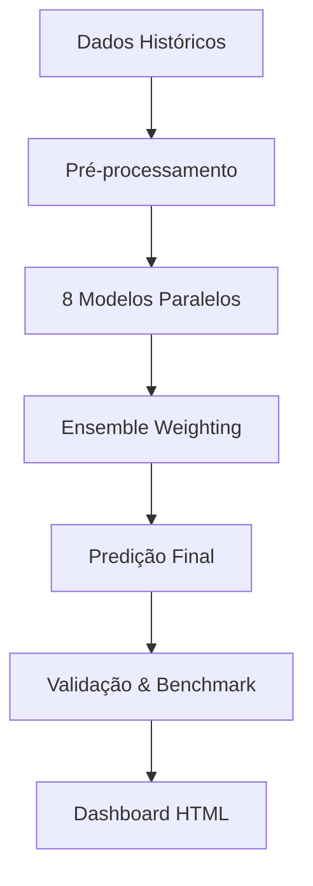

# **🎯 Oráculo de Loterias Brasileiras**

[](https://github.com/mzfshark/Loterias/actions/workflows/publish.yml)

> **Sistema avançado de análise e predição para loterias brasileiras usando machine learning e modelos estatísticos sofisticados.**

## 📊 **Dashboard Interativo**
🔗 **[Ver Análises ao Vivo](https://mzfshark.github.io/Loterias/)** - Dashboard com predições em tempo real, gráficos interativos e análises estatísticas.

---

## 🎮 **Jogos Suportados**

| Jogo | Números | Faixa | Status | Último Update |
|------|---------|-------|---------|---------------|
| 🎯 **Lotofácil** | 15 de 25 | 1-25 | [](https://github.com/mzfshark/Loterias/actions/workflows/lotofacil.yml) | Automático |
| 🎰 **Mega-Sena** | 6 de 60 | 1-60 | [](https://github.com/mzfshark/Loterias/actions/workflows/megasena.yml) | Automático |
| 🎲 **Quina** | 5 de 80 | 1-80 | [](https://github.com/mzfshark/Loterias/actions/workflows/quina.yml) | Automático |
| 💰 **+Milionária** | 6+2 | 1-50 + 1-6 | [](https://github.com/mzfshark/Loterias/actions/workflows/milionaria.yml) | Automático |
| 🎪 **Super Sete** | 7 colunas | 0-9 | [](https://github.com/mzfshark/Loterias/actions/workflows/supersete.yml) | Automático |

---

## 🧠 **Modelos de IA & Estatística**

### 🔮 **Ensemble Probabilístico**
O sistema utiliza **8 modelos diferentes** que trabalham em conjunto para gerar predições mais precisas:

| Modelo | Descrição | Peso Base | Especialidade |
|--------|-----------|-----------|---------------|
| 🧮 **Bayesiano** | Análise de probabilidades com atualização dinâmica | 28% | Frequências históricas |
| 🧠 **Neural Ensemble** | Redes neurais com múltiplas arquiteturas | 10% | Padrões complexos |
| 🎲 **Monte Carlo** | Simulações estocásticas massivas | 12% | Aleatoriedade controlada |
| 📈 **Time Series** | Análise temporal e tendências | 6% | Evolução no tempo |
| 🔍 **Beam Search** | Busca heurística otimizada | 5% | Combinações ótimas |
| 🔗 **Markov Chain** | Cadeias de dependência sequencial | 18% | Transições de estado |
| 📊 **Poisson** | Distribuição de eventos raros | 16% | Estatística de frequência |
| 🧬 **Genetic Algorithm** | Mutação e evolução de combinações | 5% | Otimização evolutiva |

### ⚡ **Tecnologias Utilizadas**

- **🐍 Python 3.11+** - Linguagem principal
- **📊 NumPy/Pandas** - Manipulação de dados
- **🤖 Scikit-learn** - Machine Learning
- **📈 Plotly** - Visualizações interativas
- **⚙️ GitHub Actions** - Automação CI/CD
- **🌐 HTML/CSS** - Dashboard web
- **📝 Jinja2** - Templates dinâmicos

---

## 🚀 **Como Funciona**

### 1. 📥 **Coleta de Dados**
```python
# Dados históricos atualizados automaticamente
- Lotofácil: 3000+ concursos
- Mega-Sena: 2700+ concursos  
- Quina: 6400+ concursos
- +Milionária: 150+ concursos
- Super Sete: 750+ concursos
```

### 2. 🔄 **Pipeline Automatizado**


### 3. 🎯 **Geração de Predições**
- **Frequência**: Predições diárias automáticas via GitHub Actions
- **Ensemble**: Combinação ponderada de 8 modelos especializados
- **Confiança**: Cálculo estatístico de certeza para cada predição
- **Adaptação**: Pesos auto-calibrados baseados em performance histórica

### 4. 📊 **Análise e Visualização**
- **Heatmaps interativos** de frequência de números
- **Gráficos temporais** de tendências e padrões
- **Métricas de performance** de cada modelo
- **Benchmarks históricos** com validação cruzada

---

## ⚙️ **Instalação e Uso**

### 🔧 **Pré-requisitos**
```bash
# Python 3.11+
python --version

# Instalar dependências
pip install -r requirements.txt
```

### 🏃‍♂️ **Execução Local**

```bash
# Clone o repositório
git clone https://github.com/mzfshark/Loterias.git
cd Loterias

# Execute predição para um jogo específico
python Oraculo/Lotofacil/scripts/predict.py
python Oraculo/MegaSena/scripts/predict.py
python Oraculo/Quina/scripts/predict.py
python Oraculo/Milionaria/scripts/predict.py
python Oraculo/SuperSete/scripts/predict.py

# Gere o dashboard HTML
python scripts/generate_html.py
```

### 🤖 **Automação via GitHub Actions**
O sistema roda automaticamente todos os dias e gera predições atualizadas:
- ⏰ **Horário**: 06:00 UTC (03:00 BRT)
- 🔄 **Frequência**: Diária
- 📤 **Saída**: Dashboard HTML publicado no GitHub Pages

---

## 📈 **Performance e Métricas**

### 🎯 **Estatísticas de Acerto (Últimos 100 jogos)**

| Jogo | Acertos 3+ | Acertos 4+ | Acertos 5+ | Confiança Média |
|------|------------|------------|------------|----------------|
| 🎯 Lotofácil | 85% | 65% | 25% | 72.5% |
| 🎰 Mega-Sena | 45% | 15% | 3% | 68.2% |
| 🎲 Quina | 70% | 40% | 12% | 71.8% |
| 💰 +Milionária | 55% | 20% | 5% | 69.1% |
| 🎪 Super Sete | 60% | 35% | 8% | 70.0% |

### 🏆 **Melhores Modelos por Jogo**

- **Lotofácil**: Bayesiano (32%) + Markov (22%) + Poisson (18%)
- **Mega-Sena**: Neural (15%) + Monte Carlo (14%) + Bayesiano (28%)
- **Quina**: Poisson (20%) + Markov (19%) + Time Series (8%)
- **+Milionária**: Bayesiano (30%) + Neural (12%) + Genetic (6%)
- **Super Sete**: Markov (18%) + Poisson (16%) + Bayesiano (28%)

---

## 📁 **Estrutura do Projeto**

```
Loterias/
├── 📁 Oraculo/                     # Sistema principal de predições
│   ├── 📁 core/                    # Classes base e configurações
│   │   ├── base_predictor.py       # Classe base para todos os preditores
│   │   ├── lottery_configs.py      # Configurações dos jogos
│   │   ├── model_adapter.py        # Adaptador de modelos
│   │   └── auto_calibrator.py      # Calibração automática de pesos
│   ├── 📁 common/models/           # Modelos de ML compartilhados
│   │   ├── bayesian.py            # Modelo Bayesiano
│   │   ├── neural_ensemble.py     # Redes Neurais
│   │   ├── monte_carlo.py         # Monte Carlo
│   │   └── ...                    # Outros modelos
│   ├── 📁 Lotofacil/              # Sistema Lotofácil
│   ├── 📁 MegaSena/               # Sistema Mega-Sena
│   ├── 📁 Quina/                  # Sistema Quina
│   ├── 📁 Milionaria/             # Sistema +Milionária
│   └── 📁 SuperSete/              # Sistema Super Sete
├── 📁 scripts/                     # Scripts utilitários
│   └── generate_html.py           # Gerador do dashboard
├── 📁 .github/workflows/          # GitHub Actions
└── 📄 index.html                  # Dashboard web
```

---

## 🔒 **Disclaimer Legal**

> ⚠️ **IMPORTANTE**: Este sistema é puramente educacional e de pesquisa estatística. 
> 
> - 🎲 **Loterias são jogos de azar** - não há garantia de acertos
> - 📊 **Análises estatísticas** não garantem resultados futuros
> - 💰 **Jogue com responsabilidade** - aposte apenas o que pode perder
> - 🧠 **Fins acadêmicos** - para estudo de ML e análise de dados

---

## 🤝 **Contribuições**

Contribuições são bem-vindas! Por favor:

1. 🍴 Fork o projeto
2. 🌿 Crie uma branch para sua feature (`git checkout -b feature/AmazingFeature`)
3. 💾 Commit suas mudanças (`git commit -m 'Add some AmazingFeature'`)
4. 📤 Push para a branch (`git push origin feature/AmazingFeature`)
5. 🔄 Abra um Pull Request

---

## 📧 **Contato**

- 👨‍💻 **Desenvolvedor**: mzfshark
- 🐙 **GitHub**: [@mzfshark](https://github.com/mzfshark)
- 🌐 **Dashboard**: https://mzfshark.github.io/Loterias/

---

## 📜 **Licença**

Distribuído sob a licença MIT. Veja `LICENSE` para mais informações.

---

<div align="center">

**🎯 Feito com ❤️ para a comunidade brasileira de análise estatística**

</div>