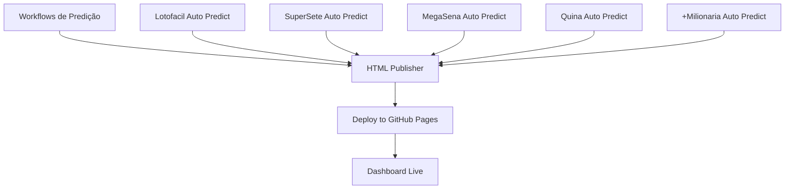

# 🚀 Pipeline de CI/CD - GitHub Pages

Este documento explica o pipeline automatizado de Continuous Integration/Continuous Deployment configurado para o dashboard das loterias.

## 📋 Fluxo de Trabalho



## 🎯 Workflows

### 1. **HTML Publisher** (`publish.yml`)
- **Trigger**: Após conclusão bem-sucedida de qualquer workflow de predição
- **Função**: Gera o dashboard HTML unificado com todas as predições
- **Duração**: ~2 minutos
- **Saída**: Publica arquivos no branch `gh-pages`

### 2. **Deploy to GitHub Pages** (`deploy-pages.yml`)  
- **Trigger**: Após conclusão bem-sucedida do HTML Publisher
- **Função**: Faz deploy dos arquivos para GitHub Pages
- **Duração**: ~1 minuto
- **Saída**: Dashboard disponível publicamente

## 📊 Arquivos Gerados

| Arquivo | Descrição | Origem |
|---------|-----------|--------|
| `index.html` | Dashboard principal | `scripts/generate_html.py` |
| `styles.css` | Estilos e tema escuro | Copiado da raiz |
| `Oraculo/*/docs/charts/*.png` | Gráficos de benchmark | Scripts de cada jogo |
| `Oraculo/*/predictions/*.json` | Dados de predições | Scripts enhanced_predict |

## 🔧 Configurações

### Variáveis de Ambiente
- `FAST_CI=0`: Execução completa (padrão no publisher)
- `PYTHONUNBUFFERED=1`: Logs em tempo real

### Permissões
- `contents: write`: Para commits no repositório
- `pages: write`: Para deploy no GitHub Pages  
- `id-token: write`: Para autenticação segura

### Timeouts
- **HTML Publisher**: 2 minutos
- **Deploy Pages**: 10 minutos

## 🌐 URLs de Acesso

- **Dashboard**: https://mzfshark.github.io/Loterias/
- **Repositório**: https://github.com/mzfshark/Loterias
- **Branch GH-Pages**: https://github.com/mzfshark/Loterias/tree/gh-pages

## 🔍 Monitoramento

### Verificações Automáticas
1. **Status do workflow anterior**: Verifica se HTML Publisher teve sucesso
2. **Integridade dos arquivos**: Confirma existência de index.html
3. **Tamanho dos arquivos**: Monitora se os arquivos não estão vazios
4. **Deploy bem-sucedido**: Confirma URL final acessível

### Logs Detalhados
- ✅ Emojis para fácil identificação de status
- 📊 Informações de tamanho de arquivos
- 🔗 URLs diretas nos summaries
- ⏱️ Timestamps precisos

## 🛠️ Manutenção

### Execução Manual
Ambos os workflows podem ser executados manualmente via:
- GitHub Actions → Workflows → "Run workflow"

### Troubleshooting
1. **HTML Publisher falha**: Verificar logs dos workflows de predição
2. **Deploy Pages falha**: Verificar permissões e branch gh-pages
3. **Site não atualiza**: Aguardar 5-10 minutos para propagação do CDN

### Rollback
- Reverter commit no branch `gh-pages`
- Ou executar novamente o HTML Publisher

## 📈 Performance

### Otimizações Implementadas
- **Debounce de 1 minuto**: Evita múltiplas execuções simultâneas
- **Cache do Python**: Acelera instalação de dependências  
- **Timeout controls**: Evita workflows "perdidos"
- **SHA-pinned actions**: Segurança e confiabilidade

### Métricas Típicas
- **HTML Publisher**: 1-2 minutos
- **Deploy Pages**: 30-60 segundos
- **Total end-to-end**: 2-4 minutos
- **Propagação CDN**: 5-10 minutos

## 🔐 Segurança

### Tokens
- `GITHUB_TOKEN`: Automático, escopo limitado
- `GH_PAT`: Personal Access Token (se configurado)

### Actions Fixadas
Todas as actions usam SHA commits específicos para segurança:
```yaml
uses: actions/checkout@692973e3d937129bcbf40652eb9f2f61becf3332 # v4.1.7
```

### Branch Protection
- Branch `gh-pages` é sobrescrito automaticamente
- Branch `main` protegido contra push direto de workflows

---

**Nota**: Este pipeline é totalmente automatizado e não requer intervenção manual para operação normal.